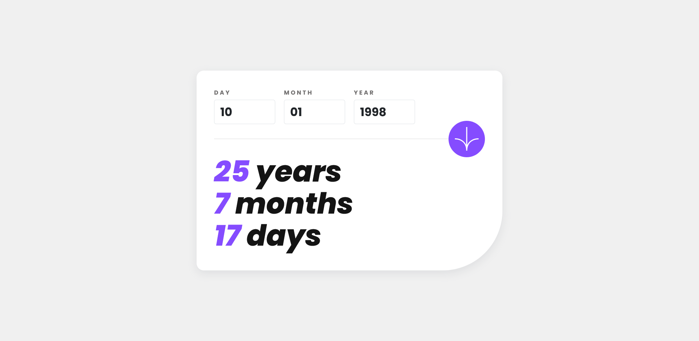

# Frontend Mentor - Age calculator app solution

This is a solution to the [Age calculator app challenge on Frontend Mentor](https://www.frontendmentor.io/challenges/age-calculator-app-dF9DFFpj-Q). Frontend Mentor challenges help you improve your coding skills by building realistic projects.

## Table of contents

- [Frontend Mentor - Age calculator app solution](#frontend-mentor---age-calculator-app-solution)
  - [Table of contents](#table-of-contents)
  - [Overview](#overview)
    - [The challenge](#the-challenge)
    - [Screenshot](#screenshot)
    - [Links](#links)
  - [My process](#my-process)
    - [Built with](#built-with)
    - [What I learned](#what-i-learned)
  - [Author](#author)

## Overview

### The challenge

Users should be able to:

- View an age in years, months, and days after submitting a valid date through the form
- Receive validation errors if:
  - Any field is empty when the form is submitted
  - The day number is not between 1-31
  - The month number is not between 1-12
  - The year is in the future
  - The date is invalid e.g. 31/04/1991 (there are 30 days in April)
- View the optimal layout for the interface depending on their device's screen size
- See hover and focus states for all interactive elements on the page
- **Bonus**: See the age numbers animate to their final number when the form is submitted

### Screenshot

### Links

- [Solution](https://www.frontendmentor.io/solutions/news-homepage-with-bootstrap-and-some-custom-css-01IjkIWw8y)
- [Live Site](https://hassaneljebyly.github.io/age-calculator-app)

## My process

### Built with

### What I learned

I learned that you don't need to over engineer everything:

did my best to get [this](https://hassaneljebyly.github.io/age-calculator-app/counter.html) to work, but the code got so big and there was tons of bugs, got annoyed, I will give it another shot after I clear my head.

## Author

- Frontend Mentor - [@hassaneljebyly](https://www.frontendmentor.io/profile/hassaneljebyly)
- Twitter - [@HassanElJebyly](https://twitter.com/hassaneljebyly)
